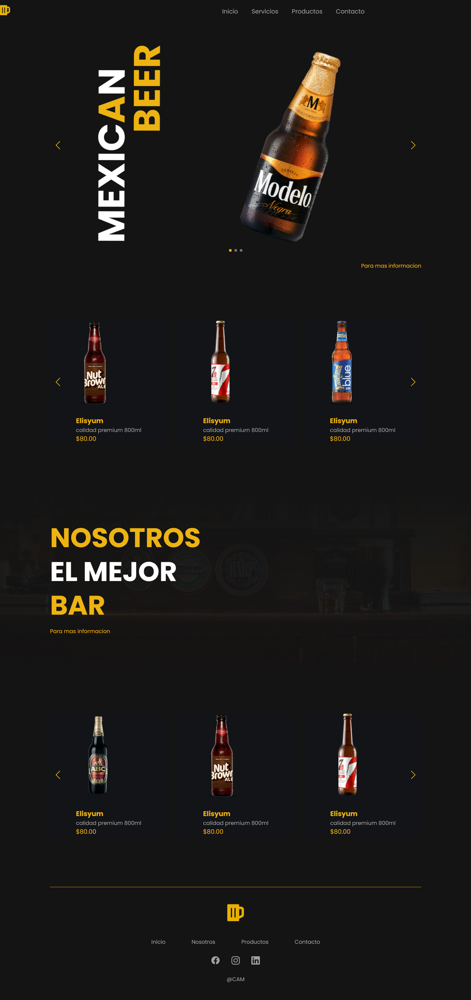

# 🍺 Sitio Web de Cervezas  

Este es un proyecto web desarrollado como práctica de diseño y maquetación front-end. El sitio simula la página principal de un bar o tienda de cervezas premium, con un diseño visual atractivo, navegación responsiva y sliders interactivos.

---

## ⚙️ Tecnologías utilizadas

- HTML5
- CSS3 
- JavaScript 
- [Swiper.js](https://swiperjs.com/) – para sliders/carouseles

---

## ✨ Funcionalidades principales

- 🎯 **Slider principal** con imágenes destacadas.
- 🍻 **Carrusel de productos** adaptativo (cambia el número de productos visibles según el tamaño de pantalla).
- 📱 **Menú hamburguesa** para dispositivos móviles.
- 🧭 Navegación intuitiva entre secciones (Inicio, Servicios, Productos, Contacto).
- 📸 Estilos visuales atractivos con diseño centrado en la experiencia del usuario.

---

## 🖥️ Vista previa

  
